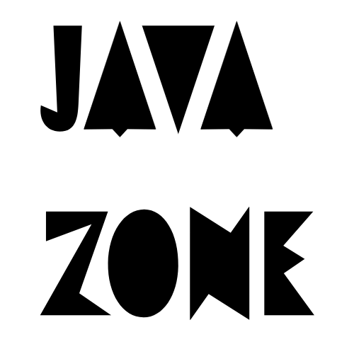

<div align="center">
  
  <h1>JavaZone 2025 Conference Platform</h1>
  <p>A modern React + TypeScript application for managing JavaZone 2025 conference</p>
</div>

## ✨ Features

### 🎯 Core Features
- **Talk Management** - Schedule talks, assign speakers & rooms
- **Speaker Profiles** - Comprehensive speaker management system
- **Room Organization** - Track capacities and schedules
- **Admin Dashboard** - Protected routes for administrative tasks

### 🎨 UI Elements
- Custom animated cursor for enhanced user experience
- Dynamic gradient background using NeatGradient
- Responsive design with modern animations
- Clean, minimalist interface

## 🚀 Quick Start

```bash
# Clone repository
git clone https://github.com/torildhov/javazone.git

# Install dependencies
npm install

# Start development server
npm run dev
```

## 🛠️ Tech Stack
### Core
⚛️ React 18
📘 TypeScript
⚡ Vite
🎨 CSS Modules

### Libraries
🧭 React Router v6
🎯 React Icons
🎨 @firecms/neat
📝 Josefin Sans Font

## 📁 Project Structure
```
src/
├── assets/          # Images and static files
├── components/      # Reusable UI components
├── context/         # React Context providers
├── hooks/           # Custom React hooks
├── pages/           # Main application pages
├── services/        # API services
└── utils/          # Helper functions
```

## 🔐 Authentication
```properties
username: admin
password: admin
```

## 🔧 Available Scripts
```shell
npm run dev      # Start development server
npm run build    # Build for production
npm run lint     # Run ESLint
npm run preview  # Preview production build
```

## 🌐 Environment Setup
This project allready contains a .env file with the API url and the API key because it is a school project.

## 💻 Development
### Prerequisites
- Node.js 18+
- npm 9+

### Code Style
- ESLint configuration
- TypeScript strict mode
- Modern ES2020+ features

## 🌟 Key Features Showcase
### Dynamic Background
- Animated gradient using NeatGradient
- Configurable colors and patterns
- Smooth transitions
- 
### Custom Cursor
- Interactive cursor animations
- Context-aware behavior
- Smooth movement tracking

### Protected Routes
- Admin access
- Role-based authentication
- Session management

### 👥 Project members
- [](https://github.com/camillachr)

- [](https://github.com/Elisabeth1690)

- [](https://github.com/guysoul)

- [](https://github.com/torildhov)
